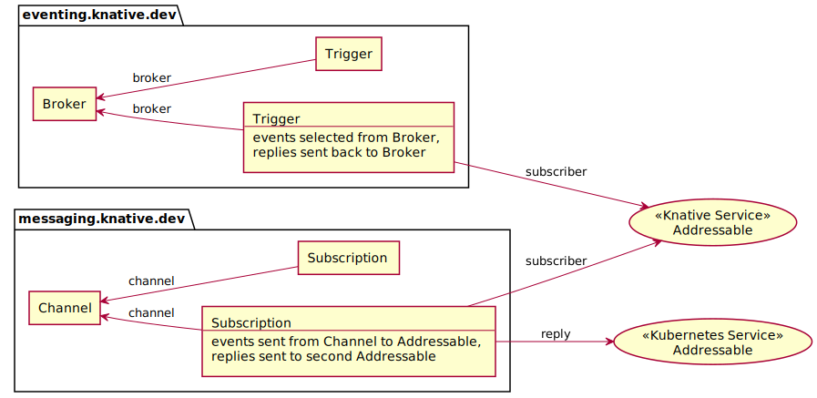

# Resource Types

The Knative Eventing API provides primitives for two common event-processing
patterns:

- Topology-based event routing ([`messaging.knative.dev`](#messaging))

  Events are routed based on _connections between objects_ (in particular,
  events flow along a [channel](#channel) to all
  [subscriptions](#subscription)). This model can be thought of as "event
  plumbing" in that events are managed like flows of water through pipes. In
  order to enable event processing, subscriptions provide a mechanism to route
  "reply" events further through the object topology.

- Content-based event routing ([`eventing.knative.dev`](#eventing))

  Events are selected for routing based on the event _attributes_ rather than
  primarily by object connections (a [broker](#broker) provides a stream of
  events which can be selected by a [trigger](#trigger)). This model is more
  akin to picking parts off a conveyor belt, where each event is considered
  separately for processing. Content-based routing handles reply events by
  re-enqueuing the events in the originating Broker.

<!-- Generated from the following UML using PlantUML:
@startuml
' Remove shadows
skinparam shadowing false
' Set ordering
left to right direction

usecase Addressable <<Knative Service>>
usecase Addressable AS A2 <<Kubernetes Service>>

package "eventing.knative.dev" {
agent Broker
agent T1 [
Trigger
--
events selected from Broker,
replies sent back to Broker
]
agent "Trigger" as T2
}

Broker <-- T1 : broker
Broker <-- T2 : broker
Addressable <-u- T1 : subscriber

package "messaging.knative.dev" {
agent Channel
agent "Subscription" as S1
agent S2 [
Subscription
---
events sent from Channel to Addressable,
replies sent to second Addressable
]
}

Channel <-- S1 :channel
Channel <-- S2 :channel
Addressable <-u- S2 :subscriber
A2 <-u- S2 : reply
@enduml
-->

Knative Eventing does not directly specify mechanisms for other event-processing
models, including multi-stage workflows, correlated request-reply, and
sequential (windowed) event processing; these models could be built using the
primitives provided by Knative, or Knative could deliver events to an external
system that implements these models.

In addition to the primitives needed to express the above patterns, Knative
Eventing defines two [_interface contracts_](#interface-contracts) to allow
connecting multiple types of Kubernetes objects as event senders and recipients
to the core primitives.

## Interface Contracts

In addition to the concrete types described below in the `messaging.knative.dev`
and `eventing.knative.dev` API groups, Knative Eventing supports referencing
objects in other API groups as destinations for event delivery. This is done by
defining partial schemas which the referenced resources must support. The
following interface contracts define resource fragments and partial schemas
(required fields on an arbitrary API object) which form a basis for Knative
Eventing.

### Addressable

[**Addressable**](./control-plane.md#addressable-v1) resources expose a resource
`address` (HTTP URL) in their `status` object. The URL is used as a destination
for delivery of events to the resource; the exposed URL must implement the
[data plane contract](data-plane.md) for receiving events.

[**Broker**](#broker) and [**Channel**](#channel) both implement **Addressable**
to receive events from other components.

### Destination

[**Destination**](./control-plane.md#duckv1destination) is an interface
(resource fragment) which is used consistently through Knative Eventing to
reference an event delivery destination. A Destination eventually resolves the
supplied information to an URL, and may be an absolute URL or
[relative](https://datatracker.ietf.org/doc/html/rfc3986#section-4.2) to an
**Addressable** object reference; it also supports a Kubernetes Service object
reference (as a special case). An absolute URL in a Destination may be used to
reference cluster-external resources such as a virtual machine or SaaS service.

### Event Source

**Event Sources** are resources which generate events and may be configured to
deliver the events to a **Destination** designated by a `sink` object in the
resource's `spec`. The Knative Eventing spec does not define any specific event
sources, but does define common interfaces for discovering and managing event
sources.

## Eventing

### Broker

[**Broker**](./control-plane.md#broker-v1) provides a central event-routing hub
which exposes a URL address which event senders may use to submit events to the
broker. A Broker may be implemented using many different underlying
event-forwarding mechanisms; the broker defines a small set of common
event-delivery configuration options and implementations of the broker may
define additional configuration options via a reference to an external object
(either a kubernetes built-in like ConfigMap or a custom object); the format of
the external objects is intentionally not standardized.

### Trigger

[**Trigger**](./control-plane.md#trigger-v1) defines a filtered delivery option
to select events delivered to a **Broker** and route them to a **Destination**.
Trigger implements uniform event filtering based on the CloudEvents attributes
associated with the event, ignoring the payload (which might be large and/or
binary and need not be parsed during event routing). The destination interface
contract allows Triggers to deliver events to either cluster-local objects or
external resources.

## Messaging

### Channel

[**Channel**](./control-plane.md#channel-v1) provides an abstract interface
which may be fulfilled by several concrete implementations of a backing
asynchronous fan-out queue. The common abstraction provided by channel allows
both the composition of higher-level constructs for chained or parallel
processing of events, and the replacement of particular messaging technologies
(for example, allowing a development environment to use a lower-reliability
channel compared with the production environment).

### Subscription

[**Subscription**](./control-plane.md#subscription-v1) defines a delivery
destination for all events sent to a **Channel**. Events sent to a channel are
delivered to _each_ subscription _independently_ -- a subscription maintains its
own list of undelivered events and will manage retries independently of any
other subscriptions to the same channel. Like **Trigger**, subscriptions use the
**Destination** interface to support event delivery to many different
destination types.
