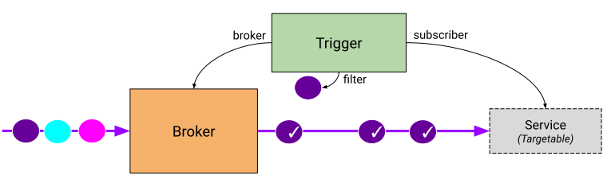
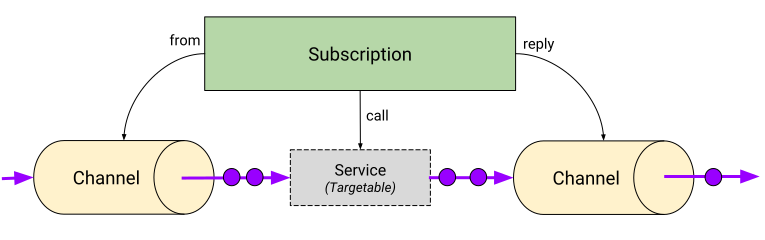

# Resource Types

The Knative Eventing API provides primitives for two common event-processing
patterns (credit to James Urquhart for the formulation):

* Point-to-point asynchronous communication ([`messaging.knative.dev`](#messaging))

* Content-based event routing ([`eventing.knative.dev`](#eventing))

The other two patterns James identifies are log-stream processing and complex
workflows; these are not currently addressed by Knative Eventing.

In addition to the primitives needed to express the above patterns, Knative
Eventing defines two [_interface contracts_](#interface-contracts) to allow
connecting multiple types of Kubernetes objects as event sernders and recipients
to the core primitives.

<!-- TODO: add a drawing -->

## Eventing

### Broker

**Broker** provides a central event-routing hub which exposes a URL address
which event senders may use to submit events to the router. A Broker may be
implemented using many different underlying event-forwarding mechanisms; the
broker provides a small set of common event-delivery configuration options and
may reference additional implementation-specific configuration options via a
reference to an external object; the format of the external objects is not
standardized.

### Trigger

**Trigger** defines a filtered delivery option to extract events delivered to a
Broker** and route them to an **Addressable** destination. Trigger implements
uniform event filtering based on the CloudEvents attributes associated with the
event, ignoring the payload (which might be large and/or binary and need not be
parsed during event routing). The addressable interface contract allows Triggers
to deliver events to a variety of different destinations, including external
resources such as a virtual machine or SaaS service.

## Messaging

### Channel

**Channel** provides an abstract interface which may be fulfiled by several
concrete implementations of a backing asynchronous fan-out queue. The common
abstraction provided by channel allows both the composition of higher-level
constructed for chained or parallel processing of events, and the replacement of
particular messaging technologies (for example, allowing a development
environment to use a lower-reliability channel compared with the production
environment).

### Subscription

**Subscription** defines a delivery destination for all events sent to a
**Channel**. Events sent to a channel are delivered to _each_ subscription
_independently_ -- a subscription maintains its own list of undelivered events
and will manage retry indpendently of any other subscriptions to the same
channel. Like **Trigger**, subscriptions use the **Addressable** interface
contract to support event delivery to many different destination types.

## Interface Contracts

In addition to the concrete types described above in the `messaging.knative.dev`
and `eventing.knative.dev` API groups, Knative Eventing supports referencing
objects in other API groups as destinations for event delivery. This is done by
defining partial schemas which the other resources must support. The following
interface contracts define a set of expected resource fields on an referenced
resource.

### Addressable

**Addressable** resources expose a resource address (HTTP URL) in their `status`
object. The URL is used as a destination for delivery of events to the resource;
the exposed URL must implement the [data plane contract](data-plane.md) for
receiving events.

**Broker** and **Channel** both implement **Addressable**.

### Event Source

**Event Sources** are resources which generate events and may be configured to
deliver the events to an **Addressable** resource designated by a `sink` object
in the resource's `spec`. The Knative Eventing spec does not define any specific
event sources, but does define common interfaces for discovering and managing
event sources.

================================================================
CUT HERE
================================================================

The API defines and provides a complete implementation for
[Trigger](spec.md#kind-trigger), [Broker](spec.md#kind-broker),
[Subscription](spec.md#kind-subscription) and abstract resource definitions for
[Channels](spec.md#kind-channel).

With extensibility and composability as a goal of Knative Eventing, the eventing
API defines  several resources that can be reduced down to well understood
contracts. These eventing resource interfaces may be fulfilled by other
Kubernetes objects and then composed in the same way as the concrete objects.
The interfaces are ([Addressable](interfaces.md#addressable),
[Callable](interfaces.md#callable)). For more details, see
[Interface Contracts](interfaces.md).

- A **Trigger** describes a filter on event attributes which should be delivered
  to an _Addressable_.

- A **Broker** provides a bucket of events which can be selected by attribute.

<!-- https://drive.google.com/open?id=1CXRvT2g6sxk6-ZrwYcSf2BahCNVlLTLNZkm-laQitMg -->

The above diagram shows a _Broker_ ingesting events and delivering to a
_Service_ only when the _Trigger_ filter matches.

- A **Subscription** describes the transformation of an event and optional
  forwarding of a returned event.

- A **Channel** provides event persistence and fanout of events from a
  well-known input address to multiple outputs described by _Subscriptions_.

<!-- This image is sourced from https://drive.google.com/open?id=10mmXzDb8S_4_ZG_hcBr7s4HPISyBqcqeJLTXLwkilRc -->

Channels as well as Sources are defined by independent CRDs that can be
installed into a cluster. Both Sources and Channels implementations can be
created directly. A Channel however offers also a way to create the backing
implementation as part of the generic Channel (using a _channelTemplate_).

## Trigger

**Trigger** describes a registration of interest on a filter set of events
delivered to a _Broker_ which should be delivered to an _Addressable_. Events
selected by a _Trigger_ are buffered independently from other _Triggers_, even
if they deliver to the same _Addressable_.

For more details, see [Kind: Trigger](spec.md#kind-trigger).

## Broker

**Broker** provides an eventing mesh. This allows producers to deliver events to
a single endpoint and not need to worry about the routing details for individual
consumers.

For more details, see [Kind: Broker](spec.md#kind-broker).

## Subscription

**Subscriptions** describe a flow of events from one _Channel_ to the next
Channel\* through transformations (such as a Knative Service which processes
CloudEvents over HTTP). A _Subscription_ controller resolves the addresses of
transformations (`subscriber`) and destination storage (`reply`) through the
_Callable_ and _Addressable_ interface contracts, and writes the resolved
addresses to the _Channel_ in the `channel` reference. _Subscriptions_ do not
need to specify both a transformation and a storage destination, but at least
one must be provided.

All event delivery linkage from a **Subscription** is 1:1 – only a single
`channel`, `subscriber`, and `reply` may be provided.

For more details, see [Kind: Subscription](spec.md#kind-subscription).

## Channel

**Channel** provides an event delivery mechanism which can fan out received
events to multiple destinations via _Subscriptions_. A _Channel_ has a single
inbound _Addressable_ interface which may accept events delivered directly or
forwarded from multiple _Subscriptions_. Different _Channels_ may implement
different degrees of persistence. Event delivery order is dependent on the
backing implementation of the _Channel_.

Event selection on a _Channel_ is 1:N – a single _Channel_ may fan out to
multiple _Subscriptions_.

See [Kind: Channel](spec.md#kind-channel).

---

_Navigation_:

- [Motivation and goals](motivation.md)
- **Resource type overview**
- [Interface contracts](interfaces.md)
- [Object model specification](spec.md)
